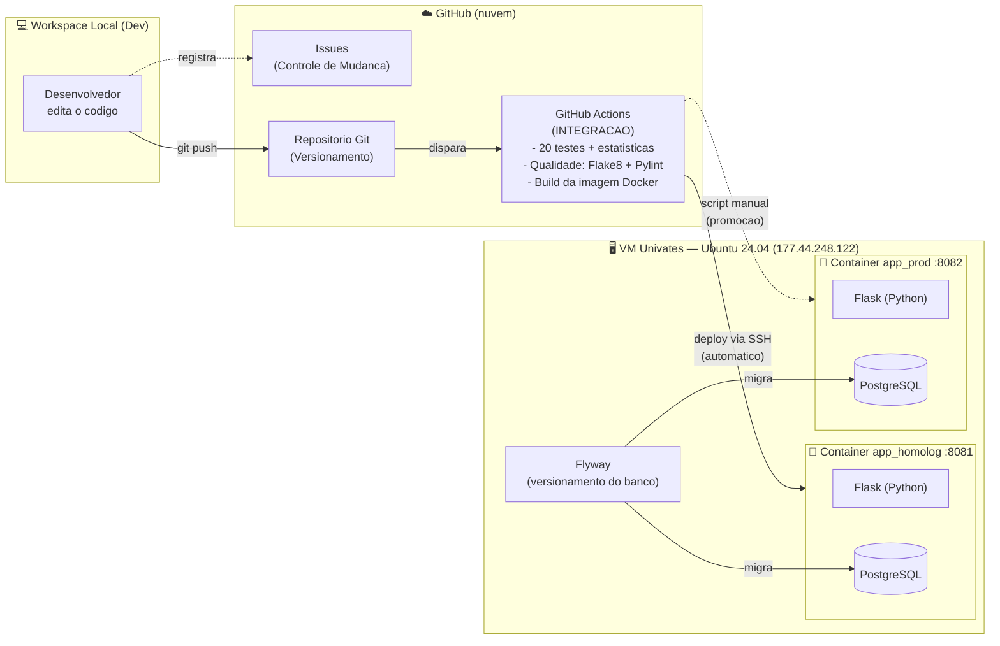

# Documento de Arquitetura — Tarefa Final GCS 2026/A

Sistema: **App Financeiro** (CRUD de finanças pessoais)
Aluno: Vinícius Stoll

Este documento descreve a arquitetura de CI/CD configurada, com todos os
ambientes (Integração, Homologação e Produção) e as tecnologias utilizadas.

---

## 1. Diagrama da arquitetura



> Caso o diagrama acima não renderize, segue a versão em texto:

```
 Dev (workspace local)
     | git push
     v
 GitHub  ── Issues (Controle de Mudanca)
   |   └─ Repositorio (Versionamento de codigo)
   |
   |  GitHub Actions (INTEGRACAO):
   |    1. Testes (20) + estatisticas
   |    2. Qualidade (Flake8 + Pylint)
   |    3. Build (Docker)
   |
   |  (deploy automatico via SSH)        (script manual)
   v                                      v
 [ Container HOMOLOGACAO :8081 ]   [ Container PRODUCAO :8082 ]
   Flask + PostgreSQL                Flask + PostgreSQL
        ^                                 ^
        |       Flyway (migracoes do banco)
        +----------------+----------------+
```

---

## 2. Tecnologias utilizadas

| Item da arquitetura | Tecnologia escolhida | Observação |
|---|---|---|
| Máquina virtual | VM Univates `177.44.248.122` | 1 vCPU, ~2 GB RAM |
| Host físico | Servidor da Univates | — |
| Sistema operacional (VM) | Ubuntu 24.04 LTS | — |
| Contêineres | **Docker** | Imagem base Ubuntu 24.04 |
| SO dos contêineres | Ubuntu 24.04 | App + banco no mesmo container |
| Linguagem de programação | **Python 3.12** (framework Flask) | — |
| Banco de dados | **PostgreSQL 16** | Um banco por ambiente |
| Controle de Mudança | **GitHub Issues** | Cada mudança vira uma issue |
| Versionamento de código | **Git + GitHub** | Repositório `trabalho_app_financeiro` |
| Versionamento de banco | **Flyway** | Migrações incrementais (V1, V2, ...) |
| Integração (CI/CD) | **GitHub Actions** | Roda na nuvem do GitHub |
| Testes automatizados | **pytest** (estilo unittest) | 20 testes + estatísticas |
| Qualidade de código | **Flake8 + Pylint** | "Mess detector" / linter |
| Automação de infraestrutura | **Shell scripts** + Docker | Instala tudo do zero |
| Deploy (transferência) | **SSH** (appleboy/ssh-action) | Actions → VM |
| Notificação | E-mail (SMTP) | Opcional, ao criar/editar lançamento |

---

## 3. Os três ambientes

| Ambiente | Onde roda | Como é atualizado |
|---|---|---|
| **Integração** | GitHub Actions (nuvem) | Automático a cada `git push` |
| **Homologação** | Container `app_homolog` na VM, porta **8081** | Automático (Actions → SSH) após os testes passarem |
| **Produção** | Container `app_prod` na VM, porta **8082** | Manual: rodar `scripts/03_atualizar_producao.sh` |

---

## 4. Por que o banco NÃO é apagado nas atualizações

O versionamento do banco é feito com **Flyway**, que trabalha com
*migrações incrementais*. Cada alteração do banco é um arquivo numerado:

- `db/migrations/V1__schema_inicial.sql` — cria as tabelas iniciais
- `db/migrations/V2__criar_tabela_categoria.sql` — adiciona a tabela nova

O Flyway guarda numa tabela de controle (`flyway_schema_history`) quais
migrações já foram aplicadas. Ao atualizar um ambiente, ele aplica
**somente as migrações novas** — ou seja, a tabela `categoria` é
adicionada **sem apagar** a tabela `lancamento` nem os dados existentes.

---

## 5. Mapa das fases pedidas na tarefa

| Fase (enunciado) | Onde está nesta solução |
|---|---|
| A) Registro da mudança | GitHub Issues |
| B) Implementação | `app.py` (código) e `db/migrations/` (banco) |
| C) Versionamento | Git + GitHub |
| D) Testes automatizados (20 + estatísticas) | `test_app.py` rodando no GitHub Actions |
| E) Análise de qualidade | Flake8 + Pylint no GitHub Actions |
| F) Atualização de Homologação | `scripts/02_atualizar_homologacao.sh` (via Actions) |
| G) Atualização de Produção | `scripts/03_atualizar_producao.sh` (manual) |
| H) Criação dos ambientes | `scripts/01_montar_ambientes.sh` |
